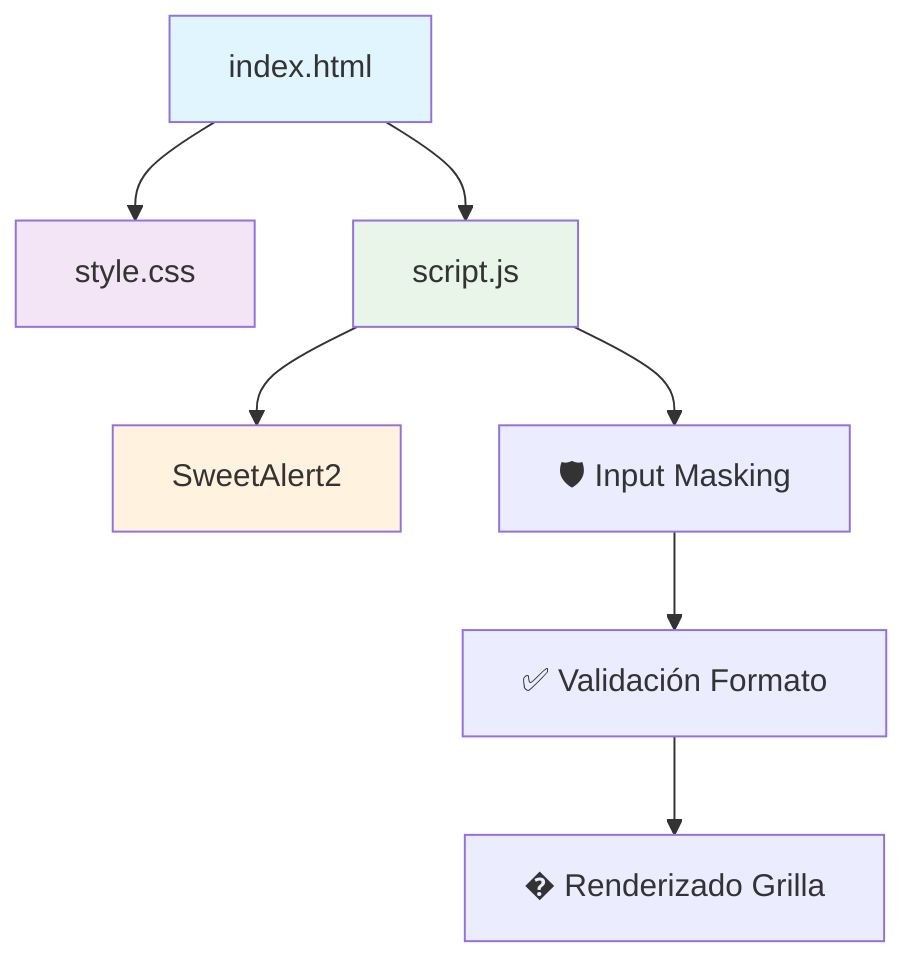
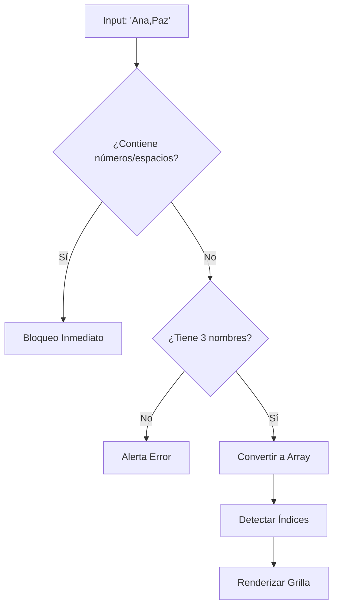

# � **Análisis de Cadenas de Texto**
## Reto Práctico Lección 3 - Arreglos y Sentencias Iterativas

***

## 🎯 **Objetivo del Ejercicio**

Crear un programa que solicite ingresar **tres nombres unidos por una coma** (un solo string). El sistema debe:
1.  **Validar** que no existan números ni espacios.
2.  **Identificar** la ubicación (índice) de cada letra y de las comas.
3.  **Visualizar** el resultado gráficamente como si fuera un arreglo.

### **Ejemplo práctico:**
```
Entrada: "Ana,Paz,Sol"
↓
Indices Comas: 3, 7
↓
[A][n][a][,][P][a][z][,][S][o][l]
 0  1  2  3  4  5  6  7  8  9  10
```

***

## 📋 **Estructura del Proyecto**



```
📁 m4-reto-l3/
├── index.html     # Estructura y carga de librerías
├── styles.css     # Estilos grid y feedback visual
└── script.js      # Lógica de validación y procesamiento
```

***

## 💻 **Lógica Principal**

```javascript
// Validación en tiempo real (Input Masking)
input.addEventListener('input', (e) => {
    // Solo permite letras, comas y apóstrofes
    // Elimina números, espacios y símbolos
    e.target.value = e.target.value.replace(/[^a-zA-ZáéíóúÁÉÍÓÚñÑ',]/g, '');
});

// Procesamiento de índices
const caracteres = [...inputString];
const indicesComas = [];
caracteres.forEach((char, index) => {
    if (char === ',') indicesComas.push(index);
});
```

### **Flujo de Ejecución:**


***

## ✨ **Características Técnicas**

| ✅ **Feature** | ✅ **Detalle** |
|---------------|----------------|
| **Input Masking** | Regex `/[^a-zA-Z...]/g` para bloquear caracteres inválidos en tiempo real. |
| **Validación Lógica** | Verifica `split(',')` para asegurar exactamente 3 nombres. |
| **Manipulación DOM** | Generación dinámica de divs para la grilla de caracteres. |
| **Spread Operator** | Uso de `[...string]` para crear el arreglo de caracteres. |
| **UX/UI** | **SweetAlert2** para modales y **CSS Grid/Flex** para resultados. |

***

## 🧪 **Casos de Prueba**

| **Entrada** | **Acción** | **Resultado Esperado** |
|-------------|------------|------------------------|
| `Maria,Pedro,Juan` | Clic "Analizar" | ✅ Muestra grilla e índices de comas. |
| `Maria Pedro Juan` | Escribir espacios | 🛡️ **Bloqueado** (No permite escribir). |
| `Maria1,Pedro2` | Escribir números | 🛡️ **Bloqueado** (No permite escribir). |
| `Ana,Paz` | Clic "Analizar" | ❌ Alerta: "Por favor, ingrese 3 nombres". |
| `?!#` | Escribir símbolos | �️ **Bloqueado**. |

***

## 📚 **Conceptos Aplicados**

1.  **Iteración de Arrays:** Uso de `forEach` para recorrer caracteres.
2.  **Strings como Arrays:** Acceso a caracteres por índice y uso de `split`.
3.  **Expresiones Regulares (Regex):** Sanitización de entrada.
4.  **Promesas (Async/Await):** Manejo de la interacción con SweetAlert2.
5.  **Event Listeners:** Manejo de eventos `click` e `input`.